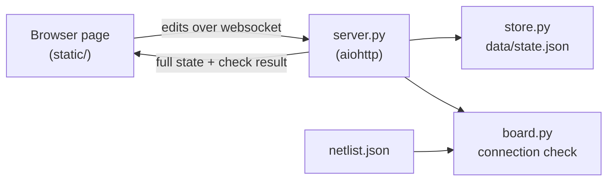

# Cube soldering tool

A local planner for hand-soldering the electronics of an ESP32 balancing cube onto a 5x7 cm
perfboard (18 columns x 24 rows). You place the parts, lay solder paths and jumper wires on the
board as seen from below, and the tool checks the result against the schematic: every net that
should be joined is joined, and nothing else is.

It is a single-user tool that runs on your own machine. It does not autoroute, and it is not a
general PCB editor.

## Quick start

Needs Python 3 and `make`.

```sh
make setup   # create .venv and install aiohttp
make start   # serve on http://127.0.0.1:8765
make open    # open the planner in the browser
```

`make` on its own shows a numbered menu of every task.

## Pages

| Page | URL | What it is for |
|------|-----|----------------|
| Planner | `/` | Move parts, solder, wire, erase, undo, show the ratsnest, flip between the solder side and the component side |
| Netlist verifier | `/verify` | Tick off each net against the schematic picture, with the traced wires overlaid |
| Print sheets | `/print` | Enlarged A4 sheets and wiring lists for the bench, with heavy-current links marked |

## Commands

| Command | What it does |
|---------|--------------|
| `make start` / `make stop` | Start or stop the server |
| `make open` / `make verify` / `make print` | Open the planner, the verifier or the print sheets |
| `make check` | Print the schematic check for the saved board; exits 1 while nets are open or shorted |
| `make test` | Run the unit tests |
| `make backup` | Copy `data/state.json` to `data/backups/` with a timestamp |
| `make trace` | Re-trace `pics/schematic.png` into `schematic-map.json` (installs numpy and pillow) |

## How it works



The server owns the board state and the page is only a view of it: every edit goes over the
websocket, and the server answers with the new state and the result of the check. The check
compares what is electrically joined on the board with the nets in `netlist.json`, which was
transcribed from `pics/schematic.png`.

Coordinates are stored as seen from the component side; only the drawing mirrors them.

## Layout

- `server.py` - HTTP, websocket and the `--check` command line
- `board.py` - board geometry and the connection check
- `store.py` - the edit operations, and loading, saving and migrating the state file
- `netlist.json` - parts, footprints, nets and wire colours
- `schematic-map.json` - where each net sits on the schematic picture, for the verifier
- `static/` - the three pages (plain HTML, CSS and JavaScript, no build step)
- `tools/trace_schematic.py` - traces the wires in the schematic picture
- `data/state.json` - the saved board layout
- `cards/`, `CLAUDE.md`, `project-plan.md` - notes for working on the code with an AI agent
