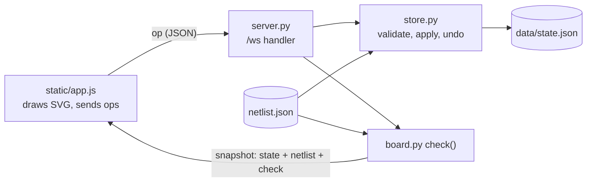

# architecture

How the planner's pieces connect: one Python process, one page, one JSON file.

## Files

| File | Role |
|------|------|
| `server.py` | aiohttp app. Serves `/`, `/verify`, `/schematic-map.json`, `/static`, `/pics`, and the `/ws` websocket. `--check` prints the check and exits. |
| `store.py` | The saved state: load, migrate, reconcile with the netlist, apply ops, undo/redo, atomic save. |
| `board.py` | Pure functions: node validity, electrical key of a node, netlist loading and validation, `check()`. |
| `netlist.json` | Parts, footprints, default positions and schematic nets. Hand-editable. |
| `data/state.json` | Where parts sit, the solder paths and wires, and which nets the user verified. |
| `static/app.js` | The planner page: all drawing and pointer handling. Holds no state of its own beyond the UI mode. |
| `static/verify.js` | The verifier page at `/verify`: the schematic picture with one net highlighted. Same websocket, only sends `verify`. |
| `schematic-map.json` | Generated by `tools/trace_schematic.py`: pin positions and traced wires in the picture. |
| `tests/test_board.py` | Unit tests for the check, the ops and the migrations. |

## Dataflow of one edit

1. The page turns a pointer gesture into an op and sends it.
2. The server reloads `netlist.json` if its mtime changed.
3. `Store.apply` validates the op against a deep copy of the state. An invalid op raises `ValueError`; the state is untouched and the sender gets `{"t": "error"}`.
4. A valid op pushes the old state on the undo stack, replaces the state and saves the file (write to `.tmp`, then rename).
5. The server runs `check()` and broadcasts a full snapshot to every connected page.
6. Each page redraws everything from the snapshot.

## Deployment shape

Local only. Binds to 127.0.0.1:8765. The websocket refuses a connection whose `Origin` host differs
from the `Host` header, so another website open in the browser cannot edit the board.
No build step, no bundler, no JS dependencies. The only Python dependency is `aiohttp`.
